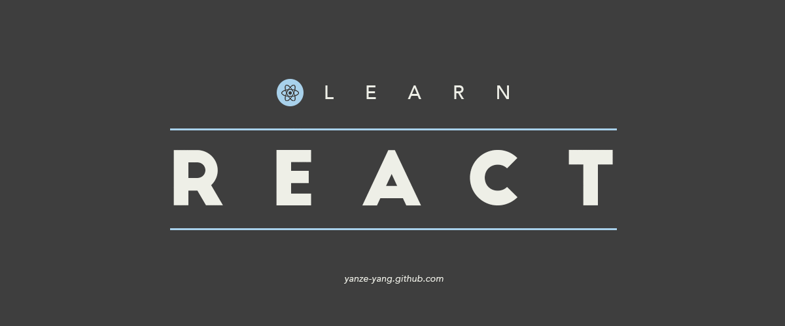

<p align="center">
  
</p>

# Learn React

- [Component Lifecycle Methods](/pages/fundamentals/lifecycle/LifeCycleParent.js)
- [Fragment](/pages/fundamentals/fragment/index.js)
- [Pure Components 1](/pages/fundamentals/pure-components/ParentComp.js) | [Pure Components 2](/pages/fundamentals/pure-components/PureComp.js)
- [Memo Components](/pages/fundamentals/memo-components/MemoComp.js)
- [Refs](/pages/fundamentals/refs/ref-and-dom.md)
- [Forwarding Refs 1](/pages/fundamentals/refs-forwarding-refs/ParentInput.js) | [Forwarding Refs 2](/pages/fundamentals/refs-forwarding-refs/ChildInput.js)
- Portal [1](https://codesandbox.io/s/ecstatic-chaplygin-chjpx?file=/src/index.js), [2](https://codepen.io/gaearon/pen/jGBWpE)
- [Error Boundary](https://www.youtube.com/watch?v=DNYXgtZBRPE&list=PLC3y8-rFHvwgg3vaYJgHGnModB54rxOk3&index=32)
- Higher Order Components [1](/pages/fundamentals/higher-order-component/Hoc1.js)
  | [2.1](/pages/fundamentals/higher-order-component/withCounter.js) | [2.2](/pages/fundamentals/higher-order-component/ClickCounter.js)

## Getting Started

Run the Next.js development server:

```bash
npm run dev
# or
yarn dev
```
